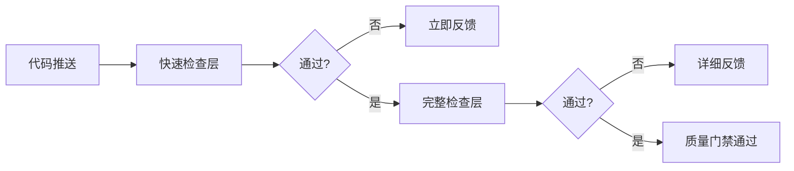
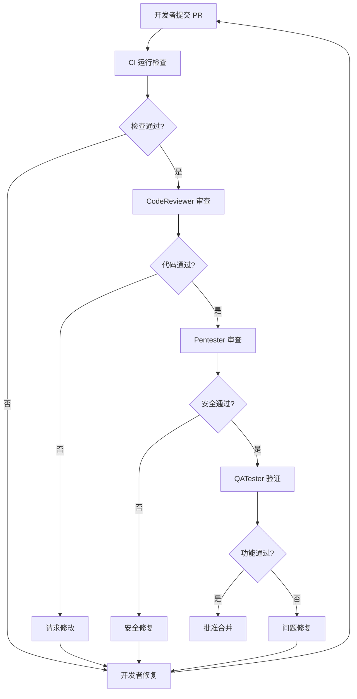
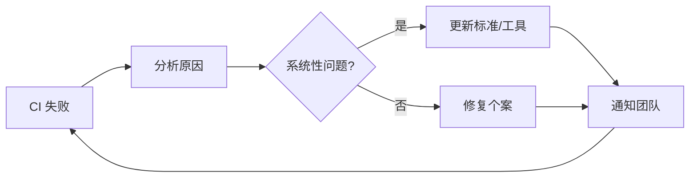

# CI/CD 质量门禁最佳实践指南

> **PRISM-Gateway 项目** - 质量保证系列文档
>
> **版本:** 1.0.0
> **最后更新:** 2026-02-06

---

## 目录

1. [核心原则](#核心原则)
2. [工作流设计](#工作流设计)
3. [质量标准](#质量标准)
4. [性能优化](#性能优化)
5. [故障处理](#故障处理)
6. [团队协作](#团队协作)
7. [持续改进](#持续改进)

---

## 核心原则

### 1. 质量优先 (Quality First)

> **"质量不是事后诸葛亮，而是事前防火墙"**

代码质量是技术债务的防火墙。每一行通过质量门禁的代码，都是对未来技术债务的预防。

**实践要点**:
- 质量门禁不可跳过
- 所有检查必须通过才能合并
- 覆盖率下降是严重问题

### 2. 快速反馈 (Fast Feedback)

> **"5 分钟内知道结果，15 分钟内完成检查"**

开发者等待的时间是浪费的时间。快速反馈意味着更快的迭代速度。

**实践要点**:
- 快速检查（类型 + Lint）< 5 分钟
- 完整检查（含测试）< 15 分钟
- 并行执行独立任务

### 3. 自动化一切 (Automate Everything)

> **"让机器做机器擅长的事，让人做人擅长的事"**

重复性的检查应该自动化，让人专注于创造性的工作。

**实践要点**:
- 所有检查自动执行
- 结果自动报告到 PR
- 阻断条件自动判断

### 4. 透明可见 (Transparency)

> **"质量状态应该一目了然"**

团队成员应该能够立即了解任何 PR 的质量状态。

**实践要点**:
- PR 页面显示检查状态
- Actions 日志公开可查
- 失败原因清晰说明

---

## 工作流设计

### 分层检查策略



| 层级 | 检查内容 | 预计时间 | 失败处理 |
|------|----------|----------|----------|
| **快速检查层** | 类型检查、Lint | < 5 分钟 | 立即反馈，快速修复 |
| **完整检查层** | 单元测试、覆盖率、安全 | < 15 分钟 | 详细报告，定位问题 |

### 触发条件设计

**推荐配置**:

```yaml
on:
  pull_request:
    branches: [main]
    paths:
      - 'src/**'
      - 'tests/**'
      - 'package.json'
      - 'tsconfig.json'

  push:
    branches: [main]

  workflow_dispatch:
```

**最佳实践**:
- PR 触发：合并前检查
- Push 触发：主分支保护
- 手动触发：应急检查

### 并行执行

```yaml
jobs:
  type-check:
    # 独立执行

  lint-check:
    # 独立执行

  unit-tests:
    # 独立执行

  quality-gate:
    needs: [type-check, lint-check, unit-tests]
    # 汇总结果
```

**性能收益**: 并行执行可减少 60-70% 的总运行时间。

---

## 质量标准

### 覆盖率标准

| 项目类型 | 推荐覆盖率 | 最低阈值 |
|----------|------------|----------|
| 核心业务逻辑 | 90%+ | 85% |
| 工具函数 | 95%+ | 90% |
| UI 组件 | 80%+ | 70% |
| 配置文件 | N/A | N/A |

**覆盖率公式**:
```
综合覆盖率 = (行覆盖率 + 分支覆盖率 + 函数覆盖率 + 语句覆盖率) / 4
```

**排除策略**:
```json
{
  "excludedPaths": [
    "**/*.test.ts",
    "**/*.spec.ts",
    "**/types/**",
    "**/mocks/**",
    "**/node_modules/**"
  ]
}
```

### 复杂度标准

| 复杂度 | 圈复杂度 | 处理方式 |
|--------|----------|----------|
| 简单 | 1-5 | 无限制 |
| 中等 | 6-10 | 需要审查 |
| 复杂 | 11-20 | 需要重构 |
| 极复杂 | 21+ | 阻断合并 |

**降低复杂度技巧**:
1. 提取函数
2. 提前返回
3. 策略模式
4. 状态机

### 安全标准

| 漏洞级别 | 影响范围 | 处理时效 |
|----------|----------|----------|
| Critical | 核心安全 | 立即修复 |
| High | 重要功能 | 24 小时内 |
| Medium | 一般功能 | 7 天内 |
| Low | 边缘情况 | 下个版本 |

---

## 性能优化

### 缓存策略

```yaml
- name: 缓存 node_modules
  uses: actions/cache@v3
  with:
    path: node_modules
    key: ${{ runner.os }}-node-${{ hashFiles('**/bun.lockb') }}
    restore-keys: |
      ${{ runner.os }}-node-
```

**收益**: 缓存命中可减少 2-3 分钟的安装时间。

### 增量检查

```yaml
# 仅检查变更的文件
- name: Lint 变更文件
  run: |
    git diff origin/main --name-only | grep '\.ts$' | xargs eslint
```

**收益**: 大型项目可减少 50%+ 的检查时间。

### 并行化测试

```typescript
// Bun Test 默认并行运行
// 使用 test.only 进行隔离测试
test.only('isolated test', () => {
  // 这个测试会单独运行
});
```

---

## 故障处理

### 常见失败模式

| 失败类型 | 频率 | 平均修复时间 |
|----------|------|--------------|
| 类型错误 | 高 | 5-15 分钟 |
| Lint 错误 | 高 | 5-10 分钟 |
| 测试失败 | 中 | 15-60 分钟 |
| 覆盖率下降 | 中 | 30-120 分钟 |
| 安全漏洞 | 低 | 60-240 分钟 |

### 快速修复清单

**类型错误**:
```bash
# 1. 本地复现
bun run tsc --noEmit

# 2. 查看错误详情
# 3. 修复类型
# 4. 验证修复
```

**Lint 错误**:
```bash
# 1. 尝试自动修复
bun run lint --fix

# 2. 手动修复剩余问题
# 3. 验证修复
```

**测试失败**:
```bash
# 1. 本地运行测试
bun test

# 2. 查看失败日志
# 3. 修复代码或测试
# 4. 验证修复
```

### 紧急情况处理

**需要绕过质量门禁的极端情况**:

1. **热修复安全漏洞**
   - 使用 `workflow_dispatch` 手动触发
   - 创建 "hotfix" 分支
   - 添加安全审查标签

2. **依赖包紧急更新**
   - 确认更新的必要性
   - 创建临时例外
   - 后续补充测试

---

## 团队协作

### 代码审查流程



### 责任分配

| 角色 | 质量责任 |
|------|----------|
| **Engineer** | 编写代码、编写测试、修复 CI 失败 |
| **CodeReviewer** | 审查代码质量、架构设计 |
| **Pentester** | 审查安全漏洞、攻击面 |
| **QATester** | 验证功能、用户体验 |

### 沟通规范

**PR 描述模板**:
```markdown
## 变更说明
[描述这个 PR 做了什么]

## 测试情况
- [ ] 单元测试通过
- [ ] 覆盖率达标
- [ ] 手动测试完成

## CI 状态
[ ] 质量门禁通过

## 审查要点
[需要审查者关注的地方]
```

---

## 持续改进

### 指标追踪

| 指标 | 目标 | 监控方式 |
|------|------|----------|
| CI 通过率 | >95% | Actions 统计 |
| 平均运行时间 | <15 分钟 | Actions 日志 |
| 平均修复时间 | <30 分钟 | PR 响应时间 |
| 覆盖率趋势 | 上升或持平 | Codecov 报告 |

### 定期审查

**月度质量会议**:
1. 回顾 CI 失败模式
2. 识别高频问题
3. 更新质量标准
4. 优化工作流

**季度工具升级**:
1. 评估依赖包更新
2. 测试新工具版本
3. 调整配置参数

### 反馈循环



---

## 参考资源

- [GitHub Actions 最佳实践](https://docs.github.com/actions/learn-github-actions/best-practices-for-github-actions)
- [测试覆盖率最佳实践](https://about.codecov.io/blog/how-to-use-code-coverage/)
- [持续集成安全扫描](https://owasp.org/www-community/Components/Continuous_Integration_Security)

---

**维护者**: PRISM-Gateway Team
**反馈**: 请在项目中创建 Issue
