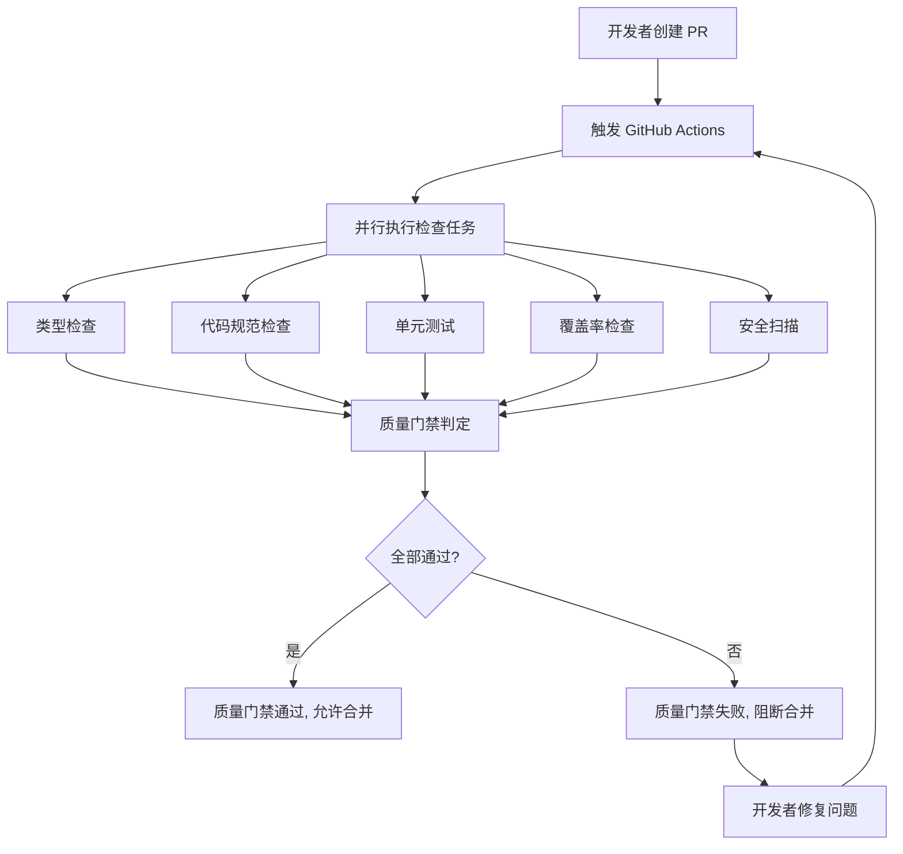

# PRISM-Gateway CI/CD 质量门禁使用文档

> **版本:** 1.0.0
> **最后更新:** 2026-02-06
> **维护者:** PRISM-Gateway Team

---

## 概述

PRISM-Gateway 质量门禁是一套基于 GitHub Actions 的自动化质量检查系统，确保所有合并到主分支的代码都符合预定义的质量标准。

### 核心特性

- **快速反馈**: 快速检查 <5 分钟，完整检查 <15 分钟
- **并行执行**: 多个检查任务同时运行，减少等待时间
- **质量门禁**: 不符合标准的代码无法合并
- **可视化报告**: PR 自动添加检查结果评论
- **历史追踪**: 测试结果和覆盖率历史记录

---

## 工作流程



---

## 质量标准

### 1. 代码覆盖率

| 指标 | 要求 |
|------|------|
| 最低覆盖率 | 85% |
| 覆盖率下降 | 阻断合并 |
| 排除文件 | `*.test.ts`, `*.spec.ts`, `types/**`, `node_modules/**` |

### 2. 代码复杂度

| 指标 | 要求 |
|------|------|
| 最大圈复杂度 | 10 |
| 超过阈值 | 阻断合并 |

### 3. 安全漏洞

| 级别 | 处理方式 |
|------|----------|
| 严重 (Critical) | 阻断合并 |
| 高危 (High) | 阻断合并 |
| 中危 (Medium) | 警告，可合并 |
| 低危 (Low) | 信息，可合并 |

### 4. 测试通过率

| 指标 | 要求 |
|------|------|
| 最低通过率 | 100% |
| 测试失败 | 阻断合并 |

---

## 使用指南

### 为新项目配置

1. **复制工作流文件**

```bash
# 将工作流文件复制到项目的 .github/workflows 目录
cp quality-gate.yml <your-project>/.github/workflows/
```

2. **调整工作目录**

编辑 `.github/workflows/quality-gate.yml`，修改 `WORKING_DIRECTORY` 环境变量：

```yaml
env:
  WORKING_DIRECTORY: './your-project-path'
```

3. **配置 package.json scripts**

确保 `package.json` 包含以下脚本：

```json
{
  "scripts": {
    "test": "bun test --coverage",
    "lint": "eslint src/",
    "type-check": "tsc --noEmit"
  }
}
```

4. **推送触发**

```bash
git push origin main
```

### 创建 Pull Request

创建 PR 后，质量门禁会自动运行：

1. 进入 GitHub 仓库
2. 点击 "Pull requests" → "New pull request"
3. 选择分支并创建 PR
4. 等待质量检查完成

### 查看检查结果

**方式一: PR 页面**

```bash
# 在 PR 页面底部可以看到自动生成的检查结果评论
```

**方式二: Actions 标签**

```bash
# 进入 Actions 标签查看详细日志
```

**方式三: 检查状态**

```bash
# 在 PR 页面的 "Checks" 部分查看各个任务状态
```

---

## 检查任务详解

### 1. 类型检查 (type-check)

**目的**: 确保代码没有 TypeScript 类型错误

**执行命令**:
```bash
tsc --noEmit
```

**失败原因**:
- 类型不匹配
- 缺少类型定义
- 类型推断失败

**修复方法**:
```typescript
// 错误示例
function add(a, b) {
  return a + b;
}

// 正确示例
function add(a: number, b: number): number {
  return a + b;
}
```

### 2. 代码规范检查 (lint-check)

**目的**: 确保代码符合 ESLint 规范

**执行命令**:
```bash
eslint src/
```

**失败原因**:
- 未使用的变量
- 不一致的代码风格
- 潜在的代码问题

**修复方法**:
```bash
# 自动修复可修复的问题
bun run lint --fix
```

### 3. 单元测试 (unit-tests)

**目的**: 确保所有单元测试通过

**执行命令**:
```bash
bun test
```

**失败原因**:
- 测试断言失败
- 测试超时
- 测试代码错误

**修复方法**:
1. 查看测试日志定位失败原因
2. 修复代码或更新测试
3. 本地验证 `bun test`

### 4. 覆盖率检查 (coverage-check)

**目的**: 确保代码覆盖率达到 85%

**执行命令**:
```bash
bun test --coverage
```

**失败原因**:
- 覆盖率低于 85%
- 覆盖率较基准下降

**修复方法**:
1. 查看覆盖率报告
2. 为未覆盖的代码添加测试
3. 重新运行检查

### 5. 安全扫描 (security-scan)

**目的**: 检测依赖包中的已知漏洞

**执行命令**:
```bash
bun audit
```

**失败原因**:
- 发现严重或高危漏洞

**修复方法**:
```bash
# 更新依赖包
bun update

# 或替换有漏洞的包
bun remove <package>
bun add <replacement>
```

---

## 质量门禁配置

### 修改覆盖率阈值

编辑 `.github/workflows/quality-gate.yml`:

```yaml
env:
  COVERAGE_THRESHOLD: '90'  # 修改为 90%
```

### 排除文件检查

编辑 `.github/quality-gate.config.json`:

```json
{
  "qualityStandards": {
    "coverage": {
      "excludedPaths": [
        "**/*.test.ts",
        "**/deprecated/**"
      ]
    }
  }
}
```

### 配置通知

编辑 `.github/quality-gate.config.json`:

```json
{
  "notifications": {
    "onPass": {
      "enabled": true,
      "message": "质量门禁通过，可以部署"
    },
    "onFail": {
      "enabled": true,
      "message": "质量门禁失败，需要修复",
      "includeDetails": true
    }
  }
}
```

---

## 最佳实践

### 1. 本地预检查

在推送代码前，先在本地运行检查：

```bash
# 类型检查
bun run tsc --noEmit

# Lint 检查
bun run lint

# 运行测试
bun test

# 安全扫描
bun audit
```

### 2. 增量提交

频繁推送小的改动，而不是一次推送大量代码：

```bash
# 好的做法
git commit -m "feat: add user login"
git push

# 避免
git commit -m "feat: add everything"
git push
```

### 3. 快速响应

质量检查失败后，快速修复并推送：

```bash
# 修复后立即推送
git commit -m "fix: resolve lint issues"
git push
```

### 4. 保持测试覆盖

每次添加新功能时，同步添加测试：

```typescript
// 新功能
function calculateTotal(items: Item[]): number {
  return items.reduce((sum, item) => sum + item.price, 0);
}

// 同步添加测试
test('calculateTotal', () => {
  const items = [{ price: 10 }, { price: 20 }];
  expect(calculateTotal(items)).toBe(30);
});
```

---

## 故障排查

### 问题: 工作流没有触发

**原因**: 文件路径不在监控范围内

**解决**: 在 `quality-gate.yml` 中添加路径到 `paths`:

```yaml
on:
  push:
    paths:
      - 'your-path/**'
```

### 问题: 覆盖率检查失败但没有覆盖率报告

**原因**: 测试框架未生成覆盖率报告

**解决**: 确保 `package.json` 中有 `--coverage` 参数:

```json
{
  "scripts": {
    "test": "bun test --coverage"
  }
}
```

### 问题: 安全扫描总是失败

**原因**: 依赖包存在未修复的漏洞

**解决**:

1. 检查漏洞详情: `bun audit`
2. 更新相关包: `bun update`
3. 或使用 `--audit-level` 临时调整级别

### 问题: 类型检查超时

**原因**: 项目较大，类型检查时间过长

**解决**: 增加 `timeout-minutes`:

```yaml
type-check:
  timeout-minutes: 10  # 增加到 10 分钟
```

---

## 扩展配置

### 添加自定义检查

在 `quality-gate.yml` 中添加新的 job:

```yaml
custom-check:
  name: 自定义检查
  runs-on: ubuntu-latest
  steps:
    - uses: actions/checkout@v4
    - name: 运行自定义检查
      run: |
        echo "执行自定义检查..."
        # 你的检查命令
```

### 集成第三方服务

**Codecov (覆盖率追踪)**:

```yaml
- name: 上传覆盖率
  uses: codecov/codecov-action@v3
  with:
    files: ./coverage/lcov.info
```

**SonarCloud (代码质量)**:

```yaml
- name: SonarCloud 扫描
  uses: SonarSource/sonarcloud-github-action@master
  env:
    GITHUB_TOKEN: ${{ secrets.GITHUB_TOKEN }}
    SONAR_TOKEN: ${{ secrets.SONAR_TOKEN }}
```

---

## 相关文档

- [GitHub Actions 文档](https://docs.github.com/actions)
- [Bun 测试文档](https://bun.sh/docs/cli/test)
- [TypeScript 文档](https://www.typescriptlang.org/docs/)
- [ESLint 文档](https://eslint.org/docs/latest/)

---

## 版本历史

| 版本 | 日期 | 变更 |
|------|------|------|
| 1.0.0 | 2026-02-06 | 初始版本 |

---

**反馈与支持**: 如有问题或建议，请在项目中创建 Issue。
