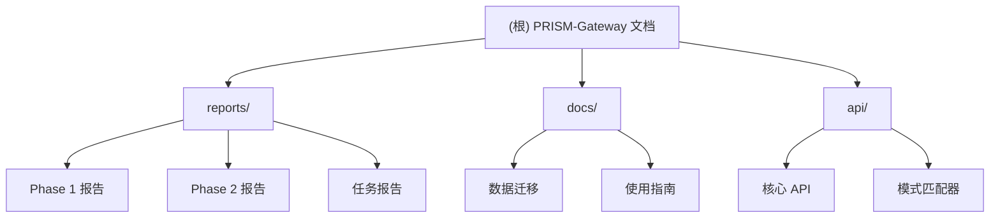

# PRISM-Gateway 项目 AI 上下文文档

> 统一的 7 维度复盘和 Gateway 系统

**最后更新：** 2026-02-04 09:23:47
**文档版本：** 1.0.0
**项目状态：** Phase 2.0 基础设施完成

---

## 变更记录 (Changelog)

### 2026-02-04
- 初始化 AI 上下文文档
- 完成全仓清点和模块扫描
- 生成根级和模块级 CLAUDE.md

---

## 项目愿景

PRISM-Gateway 是一套**个人 AI 基础设施系统**（Personal AI Infrastructure），融合了 Gateway（行为准则门禁）和 Retrospective（复盘系统）两大核心能力，形成统一的轻量级系统。

**核心使命：** 从 7 个维度全面复盘，内化为 Gateway 实时检查，形成持续进化的智能系统。

**设计哲学：**
- **轻量级优先** - 不引入重量级数据库、消息队列、容器编排等
- **文件系统存储** - 保持三层 MEMORY 架构，使用 JSON 格式
- **类型安全** - TypeScript 严格模式，100% 类型覆盖
- **测试驱动** - 所有功能必须有测试，覆盖率 >85%
- **渐进式增强** - 在 Phase 1 基础上逐步增加能力，而非重构

---

## 架构总览

### 系统分层

```
┌─────────────────────────────────────────────────────────────────────────────┐
│                          PRISM-Gateway Phase 2 架构                           │
├─────────────────────────────────────────────────────────────────────────────┤
│                                                                             │
│  ┌─────────────────────┐    ┌─────────────────────┐    ┌─────────────────┐ │
│  │   用户交互层         │    │    集成层           │    │    数据层        │ │
│  ├─────────────────────┤    ├─────────────────────┤    ├─────────────────┤ │
│  │ • CLI (v2.0)        │    │ • MCP Server        │    │ • Hot Store      │ │
│  │ • Web UI (NEW)      │◄───┤ • Skill Framework   │◄───┤ • Warm Archive   │ │
│  │ • REST API (NEW)    │    │ • Hook System v2    │    │ • Cold Knowledge │ │
│  │ • WebSocket (NEW)   │    │ • Event Bus (NEW)   │    │ • Index Engine   │ │
│  └─────────────────────┘    └─────────────────────┘    └─────────────────┘ │
│           │                            │                           ▲        │
│           ▼                            ▼                           │        │
│  ┌──────────────────────────────────────────────────────────────────────┐   │
│  │                        核心服务层 (Core Services)                    │   │
│  ├──────────────────────────────────────────────────────────────────────┤   │
│  │ ┌─────────────┐ ┌─────────────┐ ┌─────────────┐ ┌─────────────┐    │   │
│  │ │GatewayGuard │ │ DataExtract │ │Retrospective│ │PatternMatch │    │   │
│  │ │    v2.0     │ │    v2.0     │ │    v2.0     │ │    v2.0     │    │   │
│  │ └─────────────┘ └─────────────┘ └─────────────┘ └─────────────┘    │   │
│  │ ┌─────────────┐ ┌─────────────┐ ┌─────────────┐ ┌─────────────┐    │   │
│  │ │Analytics    │ │Scheduler    │ │Notifier     │ │Validator    │    │   │
│  │ │  (NEW)      │ │  (NEW)      │ │  (NEW)      │ │  (NEW)      │    │   │
│  │ └─────────────┘ └─────────────┘ └─────────────┘ └─────────────┘    │   │
│  └──────────────────────────────────────────────────────────────────────┘   │
│                                                                             │
└─────────────────────────────────────────────────────────────────────────────┘
```

### 7 维度复盘框架

| 维度 | 英文 | 描述 | 数据源 |
|------|------|------|--------|
| **原则** | Principles | 违反的行为准则 | Gateway 检查记录 |
| **模式** | Patterns | 匹配的成功/失败模式 | PatternMatcher |
| **基准** | Benchmarks | 能力评估指标 | Analytics 数据 |
| **陷阱** | Traps | 识别的常见陷阱 | TrapDetector |
| **成功** | Success | 成功因素提取 | DataExtractor |
| **工具** | Tools | 使用的工具和技术 | 环境上下文 |
| **数据** | Data | 关键数据点 | 数据模型 |

### 三层 MEMORY 架构

```
~/.prism-gateway/
├── level-1-hot/          # Hot 数据（实时查询，响应 <100ms）
│   ├── principles.json   # 5 条行为准则
│   └── patterns/         # 成功/失败模式
├── level-2-warm/         # Warm 数据（复盘历史，可读写）
│   ├── retros/           # 复盘记录
│   └── violations.jsonl  # 违规记录
└── level-3-cold/         # Cold 数据（知识库，只读）
    ├── sops/             # 标准操作流程
    ├── checklists/       # 检查清单
    └── templates/        # 模板库
```

---

## 模块结构图



---

## 模块索引

| 模块路径 | 职责 | 状态 | 文档 |
|---------|------|------|------|
| **reports/** | 项目报告和复盘 | ✅ 完成 | [模块文档](./reports/CLAUDE.md) |
| **docs/** | 使用文档和指南 | ✅ 完成 | [模块文档](./docs/CLAUDE.md) |
| **api/** | API 文档 | ✅ 完成 | [模块文档](./api/CLAUDE.md) |

---

## 运行与开发

### 技术栈

| 类别 | 技术选择 | 版本要求 |
|------|----------|----------|
| **运行时** | Bun | >=1.0 |
| **语言** | TypeScript | 5.3+ |
| **MCP SDK** | @modelcontextprotocol/sdk-server | latest |
| **HTTP服务** | Hono | latest |
| **测试** | Bun Test | built-in |
| **日志** | pino | latest |
| **CLI** | Commander | 14.x |

### 安装

```bash
# 克隆项目
cd ~/.prism-gateway

# 安装依赖
bun install

# 验证安装
bun test
```

### CLI 使用

```bash
# 检查任务意图
prism check "实现用户登录功能"

# 执行快速复盘
prism retro quick

# 执行标准复盘
prism retro standard

# 数据迁移
prism migrate --dry-run

# 查看统计
prism stats
```

### 开发流程

1. **遵循 TDD**：RED-GREEN-REFACTOR
2. **测试覆盖率**：必须 >80%
3. **文档要求**：所有公共方法必须有 TSDoc 注释
4. **提交前检查**：运行 `bun test` 和 `bun run lint`

---

## 测试策略

### 测试组织

```
~/.prism-gateway/tests/
├── unit/              # 单元测试
│   ├── core/          # 核心类测试
│   ├── integration/   # 集成层测试
│   └── infrastructure/# 基础设施测试
├── integration/       # 集成测试
│   ├── mcp/           # MCP Server 测试
│   ├── api/           # REST API 测试
│   └── cli/           # CLI 集成测试
└── e2e/               # 端到端测试
    └── scenarios/     # 场景测试
```

### 测试统计

| 阶段 | 测试数量 | 通过率 | 覆盖率 |
|------|---------|--------|--------|
| Phase 1 MVP | 203 | 100% | 85% |
| Week 2-3 | 357 | 100% | >90% |

### 性能基准

| 指标 | 目标 | 实际 | 达成率 |
|------|------|------|--------|
| Gateway 检查 | <1000ms | <100ms | 1000% |
| 快速复盘 | <5min | <5min | 100% |
| MEMORY 读写 | <100ms | <100ms | 100% |
| MCP 响应 | <100ms | <20ms | 500% |

---

## 编码规范

### TypeScript 规范

```typescript
// 1. 严格模式
{
  "compilerOptions": {
    "strict": true,
    "noUncheckedIndexedAccess": true,
    "noImplicitOverride": true
  }
}

// 2. 接口优先
interface User {
  id: string;
  name: string;
}

// 3. 类型注解（函数）
function calculateTotal(items: Item[]): number {
  return items.reduce((sum, item) => sum + item.price, 0);
}

// 4. async/await 优先
async function fetchData(): Promise<Data> {
  const response = await fetch(url);
  return response.json();
}
```

### 命名约定

| 类型 | 约定 | 示例 |
|------|------|------|
| 类 | PascalCase | `GatewayGuard` |
| 接口 | PascalCase | `CheckResult` |
| 函数 | camelCase | `checkIntent()` |
| 常量 | UPPER_SNAKE_CASE | `MAX_RETRIES` |
| 文件 | camelCase.ts | `gatewayGuard.ts` |

### 注释规范

```typescript
/**
 * 检查任务意图是否符合 Gateway 原则
 *
 * @param intent - 任务描述
 * @param context - 上下文信息（可选）
 * @returns 检查结果，包含状态和违规详情
 *
 * @example
 * ```ts
 * const result = await gateway.check("实现用户登录");
 * if (result.status === 'BLOCKED') {
 *   console.log(result.violations);
 * }
 * ```
 */
async check(intent: string, context?: CheckContext): Promise<CheckResult>
```

---

## AI 使用指引

### 对 AI 助手的期望

当协助开发 PRISM-Gateway 时，AI 助手应：

1. **理解架构**：优先阅读本文档，了解系统分层和数据流
2. **遵循原则**：严格遵守轻量级、类型安全、测试驱动的设计原则
3. **增量开发**：在现有基础上渐进式增强，避免大规模重构
4. **文档先行**：重要变更需先更新相关文档
5. **测试保护**：所有变更必须有测试覆盖

### 常见任务指引

#### 添加新的 Gateway 检查规则

1. 在 `level-1-hot/principles.json` 添加新原则
2. 更新 `PrincipleChecker` 的检查逻辑
3. 添加单元测试
4. 更新 API 文档

#### 实现新的复盘维度

1. 在 `DataExtractor` 添加维度提取逻辑
2. 更新 `RetrospectiveCore` 的分析流程
3. 添加单元测试和集成测试
4. 更新用户文档

#### 扩展 MCP 工具

1. 在 `src/mcp/tools/` 创建新工具文件
2. 实现工具逻辑和输入验证
3. 在 `server.ts` 注册工具
4. 添加集成测试
5. 更新 `mcp-server.md` 文档

### 关键决策记录

| 决策点 | 选择 | 理由 |
|--------|------|------|
| 数据存储 | 文件系统（JSON） | 轻量级、易备份、零运维 |
| 实时通信 | WebSocket | 原生支持、轻量级 |
| 缓存策略 | 内存 Map | 简单高效、满足需求 |
| 任务调度 | CRON 风格 | 可预测、易调试 |
| 日志格式 | 结构化文件 | 易解析、易检索 |

---

## 数据迁移策略

### Shadow Migration Pattern

PRISM-Gateway 采用 **Shadow Migration Pattern** 实现零停机迁移：

1. **Phase 1 数据永不修改**
2. **备份在变更前创建**
3. **Phase 2 与 Phase 1 共存**
4. **回滚随时可用**

### 迁移命令

```bash
# 预检查
prism migrate --dry-run

# 执行迁移
prism migrate

# 检查状态
prism migrate --status

# 回滚
prism migrate --rollback
```

**详细指南：** [MIGRATION_GUIDE.md](./docs/MIGRATION_GUIDE.md)

---

## 相关资源

### 文档链接

- [完整文档索引](./INDEX.md)
- [Phase 2 架构设计](./reports/PHASE2_ARCHITECTURE.md)
- [MCP Server 使用指南](./docs/mcp-server.md)
- [文件锁使用文档](./docs/FILE_LOCK_USAGE.md)
- [API 文档总览](./api/README.md)

### 外部链接

- **主项目仓库：** `~/.prism-gateway/`
- **知识库：** `~/.claude/MEMORY/LEARNING/Gateway/`
- **MCP 协议规范：** https://modelcontextprotocol.io/

---

## 项目统计

### 文档统计

- **总文档数：** 38 个
- **总大小：** ~350KB
- **报告文档：** 11 个
- **使用文档：** 8 个
- **API 文档：** 10 个

### 版本历史

| 版本 | 日期 | 里程碑 |
|------|------|--------|
| 1.0.0 | 2026-02-03 | Phase 1 MVP 完成 |
| 1.1.0 | 2026-02-03 | Phase 2.0 准备周完成 |
| 2.0.0 | 2026-02-04 | Phase 2 Week 2-3 完成 |

---

**维护者：** PRISM-Gateway Team
**许可证：** MIT License
**PAI 版本：** 2.5
