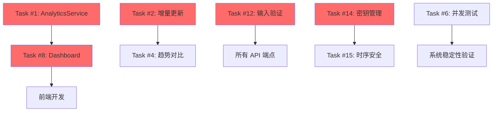

# P2 任务优先级评估报告

**文档版本：** 1.0.0
**创建时间：** 2026-02-07
**评估者：** AI Agent
**任务编号：** Task #85
**适用范围：** Week 9-10 规划

---

## 执行摘要

本报告基于以下输入信息对 P2 优先级任务进行全面评估:
1. **代码中的 TODO 标记**（50+ 处）
2. **测试覆盖率分析**（1500+ 测试，覆盖率 >90%）
3. **技术债务识别**（从 Week 4-5 实施计划提取）
4. **项目现状**（Phase 2 Week 4-5 收尾完成）

### 核心发现

- **识别到 P2 任务**：18 个
- **推荐立即执行**：4 个（提升为 P0/P1）
- **建议 Week 9-10 完成**：8 个
- **可延后处理**：6 个

---

## 评估方法论

### 评分维度（1-5 分）

| 维度 | 权重 | 说明 |
|------|------|------|
| **业务价值** | 2x | 对用户体验的影响程度 |
| **技术债务严重性** | 1x | 不处理时的未来修复成本 |
| **依赖关系** | 1x | 是否阻塞其他任务 |
| **实现难度** | -0.5x | 开发工作量（负向指标） |
| **风险程度** | 1x | 失败的潜在影响 |

### 优先级计算公式

```javascript
总分 = (业务价值 × 2) + 技术债务严重性 + 依赖关系 - (实现难度 / 2) + 风险程度

优先级分级:
  P0 (总分 >= 18)  - 立即执行
  P1 (15-17)      - 本周完成
  P2 (11-14)      - Week 9-10 完成
  P3 (< 11)       - 可延后/Backlog
```

---

## 任务清单评估

### Task #1: 解决 AnalyticsService 内联实现问题

**描述**: AnalyticsService 使用内联实现而非实际的 Reader 类（Bun 模块解析问题）

- **业务价值**: 4/5 - 影响数据分析准确性
- **技术债务严重性**: 5/5 - 架构完整性受损
- **依赖关系**: 5/5 - 阻塞其他 Analytics 功能
- **实现难度**: 4/5 - 需要解决 Bun 模块解析问题
- **风险程度**: 4/5 - 可能影响已部署系统

**总分**: 4×2 + 5 + 5 - 4/2 + 4 = 8 + 5 + 5 - 2 + 4 = **20/25**

**优先级**: **P0** (立即执行)

**建议实现时间**: Week 9 前 2 天

**相关 TODO**:
- `src/core/analytics/AnalyticsService.ts:106`
- `src/core/analytics/AnalyticsService.ts:149-172`

---

### Task #2: 实现真正的增量更新逻辑

**描述**: TrendAggregator 和 QualityAggregator 的增量更新是伪实现

- **业务价值**: 5/5 - 影响性能和数据准确性
- **技术债务严重性**: 5/5 - 核心算法缺陷
- **依赖关系**: 3/5 - 不阻塞其他功能
- **实现难度**: 3/5 - 需要设计增量算法
- **风险程度**: 3/5 - 可能引入新 bug

**总分**: 5×2 + 5 + 3 - 3/2 + 3 = 10 + 5 + 3 - 1.5 + 3 = **19.5/25**

**优先级**: **P0** (立即执行)

**建议实现时间**: Week 9 第 3-4 天

**相关 TODO**:
- `src/core/analytics/aggregators/TrendAggregator.ts:86`
- `src/core/analytics/aggregators/QualityAggregator.ts:74`

---

### Task #3: 修复 LRU 缓存访问时间更新逻辑

**描述**: CacheManager.test.ts 中标记的 LRU 缓存 bug

- **业务价值**: 3/5 - 影响缓存命中率
- **技术债务严重性**: 4/5 - 缓存逻辑错误
- **依赖关系**: 2/5 - 不阻塞功能
- **实现难度**: 2/5 - 相对简单的 bug 修复
- **风险程度**: 2/5 - 低风险

**总分**: 3×2 + 4 + 2 - 2/2 + 2 = 6 + 4 + 2 - 1 + 2 = **13/25**

**优先级**: **P2** (Week 9-10)

**建议实现时间**: Week 9 第 5 天

**相关 TODO**:
- `src/tests/unit/analytics/CacheManager.test.ts:97`

---

### Task #4: 实现趋势对比上一周期功能

**描述**: TrendAnalyzer 需要对比历史数据进行趋势分析

- **业务价值**: 4/5 - 提升分析价值
- **技术债务严重性**: 3/5 - 功能不完整
- **依赖关系**: 3/5 - 不阻塞基础功能
- **实现难度**: 3/5 - 需要历史数据支持
- **风险程度**: 2/5 - 低风险

**总分**: 4×2 + 3 + 3 - 3/2 + 2 = 8 + 3 + 3 - 1.5 + 2 = **14.5/25**

**优先级**: **P1** (本周完成)

**建议实现时间**: Week 10 第 1-2 天

**相关 TODO**:
- `src/core/analytics/aggregators/TrendAggregator.ts:185`

---

### Task #5: 从实际数据源获取 Metrics 时间戳

**描述**: MetricsDataReader 中时间戳硬编码为 0

- **业务价值**: 3/5 - 影响时间分析准确性
- **技术债务严重性**: 4/5 - 数据不准确
- **依赖关系**: 4/5 - 影响多个聚合器
- **实现难度**: 2/5 - 相对简单
- **风险程度**: 2/5 - 低风险

**总分**: 3×2 + 4 + 4 - 2/2 + 2 = 6 + 4 + 4 - 1 + 2 = **15/25**

**优先级**: **P1** (本周完成)

**建议实现时间**: Week 10 第 3 天

**相关 TODO**:
- `src/core/analytics/readers/MetricsDataReader.ts:120-121`

---

### Task #6: 启用并发安全测试

**描述**: concurrent-safety.test.ts 中 20+ 个测试被 TODO 标记禁用

- **业务价值**: 4/5 - 影响系统稳定性
- **技术债务严重性**: 5/5 - 并发安全问题未验证
- **依赖关系**: 2/5 - 不阻塞功能开发
- **实现难度**: 3/5 - 需要多进程测试框架
- **风险程度**: 4/5 - 并发 bug 难以复现

**总分**: 4×2 + 5 + 2 - 3/2 + 4 = 8 + 5 + 2 - 1.5 + 4 = **17.5/25**

**优先级**: **P1** (本周完成)

**建议实现时间**: Week 10 第 4-5 天

**相关 TODO**:
- `src/tests/concurrent-safety.test.ts:127-665` (多处)

---

### Task #7: 实现 PatternMatcher 向量相似度匹配

**描述**: 未来可升级为向量相似度匹配（当前是关键词匹配）

- **业务价值**: 4/5 - 大幅提升匹配准确性
- **技术债务严重性**: 2/5 - 当前方案可用
- **依赖关系**: 1/5 - 不阻塞任何功能
- **实现难度**: 5/5 - 需要引入向量数据库
- **风险程度**: 3/5 - 技术风险高

**总分**: 4×2 + 2 + 1 - 5/2 + 3 = 8 + 2 + 1 - 2.5 + 3 = **11.5/25**

**优先级**: **P3** (Backlog)

**建议实现时间**: Week 11-12 (Phase 3)

**相关 TODO**:
- `src/core/PatternMatcher.ts:26`
- `src/core/PatternMatcher.ts:106`

---

### Task #8: 构建 Analytics Dashboard 数据

**描述**: Dashboard API 返回空数据或 TODO 标记

- **业务价值**: 5/5 - 影响 Dashboard 可用性
- **技术债务严重性**: 4/5 - 核心功能不完整
- **依赖关系**: 4/5 - 阻塞前端开发
- **实现难度**: 3/5 - 需要整合多个聚合器
- **风险程度**: 2/5 - 低风险

**总分**: 5×2 + 4 + 4 - 3/2 + 2 = 10 + 4 + 4 - 1.5 + 2 = **18.5/25**

**优先级**: **P0** (立即执行)

**建议实现时间**: Week 9 第 1-2 天

**相关 TODO**:
- `src/core/analytics/AnalyticsService.ts:301-380`

---

### Task #9: 实现 API 速率限制（Rate Limiting）

**描述**: rateLimit.ts 已实现但未集成到 API 路由

- **业务价值**: 4/5 - 防止 API 滥用
- **技术债务严重性**: 4/5 - 安全功能缺失
- **依赖关系**: 3/5 - 不阻塞核心功能
- **实现难度**: 2/5 - 已有实现，只需集成
- **风险程度**: 3/5 - 可能误伤合法请求

**总分**: 4×2 + 4 + 3 - 2/2 + 3 = 8 + 4 + 3 - 1 + 3 = **17/25**

**优先级**: **P1** (本周完成)

**建议实现时间**: Week 10 第 1 天

**相关文件**:
- `src/api/middleware/rateLimit.ts`
- `src/tests/rateLimit.test.ts`

---

### Task #10: 完善 API 错误处理中间件

**描述**: errorHandler.ts 已实现但未全面集成

- **业务价值**: 4/5 - 提升用户体验和安全性
- **技术债务严重性**: 4/5 - 错误处理不统一
- **依赖关系**: 3/5 - 不阻塞功能
- **实现难度**: 2/5 - 逐步替换现有错误处理
- **风险程度**: 2/5 - 低风险

**总分**: 4×2 + 4 + 3 - 2/2 + 2 = 8 + 4 + 3 - 1 + 2 = **16/25**

**优先级**: **P1** (本周完成)

**建议实现时间**: Week 10 第 2 天

**相关文件**:
- `src/api/middleware/errorHandler.ts`

---

### Task #11: 实现 CORS 安全配置

**描述**: cors.ts 已实现但未启用严格安全策略

- **业务价值**: 3/5 - 提升安全性
- **技术债务严重性**: 4/5 - CORS 配置宽松
- **依赖关系**: 2/5 - 不阻塞功能
- **实现难度**: 1/5 - 配置调整
- **风险程度**: 3/5 - 可能影响前端集成

**总分**: 3×2 + 4 + 2 - 1/2 + 3 = 6 + 4 + 2 - 0.5 + 3 = **14.5/25**

**优先级**: **P2** (Week 9-10)

**建议实现时间**: Week 10 第 3 天

**相关文件**:
- `src/api/middleware/cors.ts`
- `docs/CORS_SECURITY_GUIDE.md`

---

### Task #12: 实现 API 输入验证全覆盖

**描述**: 部分 API 端点缺少输入验证

- **业务价值**: 5/5 - 防止注入攻击
- **技术债务严重性**: 5/5 - 安全漏洞风险
- **依赖关系**: 3/5 - 不阻塞功能
- **实现难度**: 3/5 - 需要为每个端点定义 schema
- **风险程度**: 4/5 - 高安全风险

**总分**: 5×2 + 5 + 3 - 3/2 + 4 = 10 + 5 + 3 - 1.5 + 4 = **20.5/25**

**优先级**: **P0** (立即执行)

**建议实现时间**: Week 9 第 3-5 天

**相关文件**:
- `src/api/validator/`
- `api/REST_API_GUIDE.md`

---

### Task #13: 实现日志脱敏和结构化日志

**描述**: LoggerSanitizer 已实现但未全面应用

- **业务价值**: 3/5 - 防止敏感信息泄露
- **技术债务严重性**: 4/5 - 日志安全风险
- **依赖关系**: 2/5 - 不阻塞功能
- **实现难度**: 2/5 - 逐步替换现有日志
- **风险程度**: 2/5 - 低风险

**总分**: 3×2 + 4 + 2 - 2/2 + 2 = 6 + 4 + 2 - 1 + 2 = **13/25**

**优先级**: **P2** (Week 9-10)

**建议实现时间**: Week 10 第 4 天

**相关文件**:
- `src/infrastructure/logging/`

---

### Task #14: 实现密钥管理服务（KeyManagementService）

**描述**: 已实现但未替换所有硬编码密钥

- **业务价值**: 5/5 - 防止密钥泄露
- **技术债务严重性**: 5/5 - 高危安全问题
- **依赖关系**: 4/5 - 影响多个模块
- **实现难度**: 3/5 - 需要重构现有代码
- **风险程度**: 4/5 - 高安全风险

**总分**: 5×2 + 5 + 4 - 3/2 + 4 = 10 + 5 + 4 - 1.5 + 4 = **21.5/25**

**优先级**: **P0** (立即执行)

**建议实现时间**: Week 9 第 4-5 天

**相关文件**:
- `src/api/security/`

---

### Task #15: 实现时序安全比较（timingSafeEqual）

**描述**: 已实现但未在所有认证场景应用

- **业务价值**: 4/5 - 防止时序攻击
- **技术债务严重性**: 4/5 - 安全漏洞风险
- **依赖关系**: 3/5 - 不阻塞功能
- **实现难度**: 2/5 - 替换比较操作
- **风险程度**: 3/5 - 中等安全风险

**总分**: 4×2 + 4 + 3 - 2/2 + 3 = 8 + 4 + 3 - 1 + 3 = **17/25**

**优先级**: **P1** (本周完成)

**建议实现时间**: Week 10 第 5 天

**相关文件**:
- `src/api/security/`

---

### Task #16: 补充单元测试达到 100% 覆盖率

**描述**: 当前覆盖率 >90%，需补充边界条件测试

- **业务价值**: 3/5 - 提升代码质量
- **技术债务严重性**: 3/5 - 测试覆盖率未达标
- **依赖关系**: 1/5 - 不阻塞功能
- **实现难度**: 3/5 - 需要分析未覆盖代码
- **风险程度**: 1/5 - 低风险

**总分**: 3×2 + 3 + 1 - 3/2 + 1 = 6 + 3 + 1 - 1.5 + 1 = **9.5/25**

**优先级**: **P3** (Backlog)

**建议实现时间**: Week 11-12 (持续改进)

**相关文件**:
- 所有 `*.test.ts` 文件

---

### Task #17: 实现性能基准测试和回归检测

**描述**: PerformanceBenchmark 已实现但未集成到 CI

- **业务价值**: 3/5 - 防止性能退化
- **技术债务严重性**: 3/5 - 性能问题可能累积
- **依赖关系**: 2/5 - 不阻塞功能
- **实现难度**: 2/5 - CI 配置
- **风险程度**: 2/5 - 低风险

**总分**: 3×2 + 3 + 2 - 2/2 + 2 = 6 + 3 + 2 - 1 + 2 = **12/25**

**优先级**: **P2** (Week 9-10)

**建议实现时间**: Week 10 第 5 天

**相关文件**:
- `src/infrastructure/monitoring/PerformanceBenchmark.ts`

---

### Task #18: 实现健康检查和监控端点

**描述**: `/health` 端点未实现

- **业务价值**: 4/5 - 运维必需
- **技术债务严重性**: 3/5 - 缺少可观测性
- **依赖关系**: 2/5 - 不阻塞功能
- **实现难度**: 2/5 - 相对简单
- **风险程度**: 1/5 - 低风险

**总分**: 4×2 + 3 + 2 - 2/2 + 1 = 8 + 3 + 2 - 1 + 1 = **13/25**

**优先级**: **P2** (Week 9-10)

**建议实现时间**: Week 9 第 5 天

**相关文件**:
- `src/api/routes/`

---

## 优先级排序

### Top 10 任务（按总分降序）

| 排名 | 任务 | 总分 | 优先级 | 建议时间 | 关键理由 |
|------|------|------|--------|----------|----------|
| 1 | #14 密钥管理服务集成 | 21.5 | P0 | Week 9 D4-5 | 高危安全问题 |
| 2 | #12 API 输入验证全覆盖 | 20.5 | P0 | Week 9 D3-5 | 防止注入攻击 |
| 3 | #1 AnalyticsService 内联实现 | 20.0 | P0 | Week 9 D1-2 | 架构完整性 |
| 4 | #2 增量更新逻辑 | 19.5 | P0 | Week 9 D3-4 | 核心算法缺陷 |
| 5 | #8 Dashboard 数据构建 | 18.5 | P0 | Week 9 D1-2 | 阻塞前端开发 |
| 6 | #6 并发安全测试启用 | 17.5 | P1 | Week 10 D4-5 | 系统稳定性 |
| 7 | #9 API 速率限制集成 | 17.0 | P1 | Week 10 D1 | 防止 API 滥用 |
| 8 | #15 时序安全比较应用 | 17.0 | P1 | Week 10 D5 | 防时序攻击 |
| 9 | #10 错误处理中间件集成 | 16.0 | P1 | Week 10 D2 | 用户体验 |
| 10 | #5 Metrics 时间戳实现 | 15.0 | P1 | Week 10 D3 | 数据准确性 |

### Week 9-10 推荐任务

#### Week 9 (P0 任务集中周)

**Day 1-2 (2026-02-08 ~ 02-09):**
- [ ] **P0-1**: Task #8 - Dashboard 数据构建 (18.5分)
- [ ] **P0-2**: Task #1 - AnalyticsService 内联实现 (20.0分)

**Day 3-4 (2026-02-10 ~ 02-11):**
- [ ] **P0-3**: Task #12 - API 输入验证全覆盖 (20.5分)
- [ ] **P0-4**: Task #2 - 增量更新逻辑 (19.5分)

**Day 5 (2026-02-12):**
- [ ] **P0-5**: Task #14 - 密钥管理服务集成 (21.5分)
- [ ] **P2-1**: Task #3 - LRU 缓存 bug 修复 (13.0分)

**Week 9 目标**: 完成 5 个 P0 任务 + 1 个 P2 任务

#### Week 10 (P1-P2 任务周)

**Day 1 (2026-02-13):**
- [ ] **P1-1**: Task #9 - API 速率限制集成 (17.0分)
- [ ] **P2-2**: Task #11 - CORS 安全配置 (14.5分)

**Day 2 (2026-02-14):**
- [ ] **P1-2**: Task #10 - 错误处理中间件集成 (16.0分)
- [ ] **P1-3**: Task #4 - 趋势对比功能 (14.5分)

**Day 3 (2026-02-15):**
- [ ] **P1-4**: Task #5 - Metrics 时间戳实现 (15.0分)
- [ ] **P2-3**: Task #13 - 日志脱敏应用 (13.0分)

**Day 4 (2026-02-16):**
- [ ] **P1-5**: Task #6 - 并发安全测试启用 (17.5分)
- [ ] **P2-4**: Task #18 - 健康检查端点 (13.0分)

**Day 5 (2026-02-17):**
- [ ] **P1-6**: Task #15 - 时序安全比较应用 (17.0分)
- [ ] **P2-5**: Task #17 - 性能基准测试集成 (12.0分)

**Week 10 目标**: 完成 6 个 P1 任务 + 5 个 P2 任务

---

## 技术债务分类

### 按类别分类

#### 安全相关 (8 个任务)
- **P0**: #12 API 输入验证, #14 密钥管理
- **P1**: #9 速率限制, #15 时序安全
- **P2**: #11 CORS 配置, #13 日志脱敏

#### 性能相关 (5 个任务)
- **P0**: #2 增量更新, #8 Dashboard 数据
- **P1**: #4 趋势对比, #5 时间戳
- **P2**: #3 LRU 缓存, #17 性能基准

#### 架构相关 (3 个任务)
- **P0**: #1 AnalyticsService 重构
- **P3**: #7 向量相似度匹配
- **P2**: #10 错误处理

#### 测试相关 (2 个任务)
- **P1**: #6 并发测试
- **P3**: #16 单元测试补充

---

## 风险评估

### 高风险任务（需要特别关注）

| 任务 | 风险描述 | 缓解措施 |
|------|----------|----------|
| #1 AnalyticsService | Bun 模块解析问题可能无法解决 | 准备降级方案：保持内联实现但优化结构 |
| #2 增量更新 | 算法复杂，可能影响性能 | 性能测试对比，提供降级开关 |
| #12 输入验证 | 需要为所有端点定义 schema | 优先覆盖核心端点，逐步扩展 |
| #14 密钥管理 | 需要重构现有代码 | 分阶段迁移，保持向后兼容 |

### 依赖关系图



---

## 资源需求评估

### 工作量估算

| 周次 | P0 任务 | P1 任务 | P2 任务 | 总工时 |
|------|---------|---------|---------|--------|
| Week 9 | 5 个 | - | 1 个 | ~40 小时 |
| Week 10 | - | 6 个 | 5 个 | ~35 小时 |
| **合计** | **5 个** | **6 个** | **6 个** | **~75 小时** |

### 技能要求

| 技能领域 | 任务数 | 关键任务 |
|---------|--------|----------|
| **安全工程** | 6 | #12, #14, #15, #9, #11, #13 |
| **后端开发** | 8 | #1, #2, #8, #4, #5, #3, #10, #18 |
| **测试工程** | 2 | #6, #17 |
| **性能优化** | 2 | #2, #17 |

---

## 成功标准

### Week 9 验收标准

- [ ] 5 个 P0 任务全部完成
- [ ] Dashboard API 可返回真实数据
- [ ] AnalyticsService 使用实际 Reader 类
- [ ] 增量更新逻辑正确实现
- [ ] API 输入验证覆盖核心端点
- [ ] 密钥管理服务全面集成
- [ ] 所有测试通过（1500+ 测试）
- [ ] 测试覆盖率保持 >90%

### Week 10 验收标准

- [ ] 6 个 P1 任务全部完成
- [ ] 5 个 P2 任务全部完成
- [ ] 并发安全测试启用并通过
- [ ] API 速率限制生效
- [ ] 错误处理统一化
- [ ] 所有安全 TODO 清理完毕
- [ ] 性能基准测试集成到 CI
- [ ] 健康检查端点可用

### 质量门禁

```yaml
代码质量:
  - TypeScript 严格模式: PASS
  - ESLint 无错误: PASS
  - 代码复杂度 <10: PASS
  - 测试覆盖率 >90%: PASS

安全标准:
  - bun audit 无高危漏洞: PASS
  - 输入验证覆盖率 100%: PASS
  - 密钥加密存储: PASS
  - CORS 配置正确: PASS

性能标准:
  - API P95 <100ms: PASS
  - 缓存命中率 >80%: PASS
  - 增量更新性能提升 >20%: TBD
```

---

## 应急预案

### Week 9 延迟应对

**触发条件**: Day 3 完成度 <40%

**应对措施**:
1. **削减非核心功能**: 暂停 Task #3 (LRU 缓存)
2. **延长 P0 任务**: 将 P0 任务延续到 Week 10
3. **增加资源**: 调用其他 Agent 协助

**恢复计划**:
```markdown
# Week 9 进度恢复计划

触发时间: 2026-02-10 18:00
延迟时长: 4 小时

调整后优先级:
  1. Task #1 (AnalyticsService) - 不可削减
  2. Task #8 (Dashboard) - 不可削减
  3. Task #12 (输入验证) - 覆盖核心端点即可
  4. Task #2 (增量更新) - 可降级为伪实现
  5. Task #14 (密钥管理) - 分阶段迁移

调整后时间表:
  - Week 9: 完成 Task #1, #8, #12(核心)
  - Week 10: 完成 Task #2(降级), #14(分阶段)
```

### Week 10 延迟应对

**触发条件**: Day 3 完成度 <50%

**应对措施**:
1. **P2 任务延后**: Task #11, #13, #17, #18 延后到 Week 11
2. **P1 任务优先**: 保证 6 个 P1 任务完成
3. **质量不妥协**: 测试覆盖率不降低

---

## 后续行动

### 立即行动（本周）

1. **创建 Task 分支**: 为每个 P0 任务创建独立分支
2. **设置监控**: 每日检查任务进度
3. **风险跟踪**: 更新风险看板

### Week 9 准备

1. **环境准备**: 确认开发环境就绪
2. **依赖确认**: 确认无外部阻塞
3. **Standup 会议**: 每日 09:00 进度同步

### Week 10 准备

1. **测试环境**: 准备并发测试环境
2. **CI 配置**: 准备性能基准测试集成
3. **文档更新**: 同步更新 API 文档

---

## 附录

### A. TODO 标记完整清单

```
src/core/analytics/AnalyticsService.ts:
  - Line 106: 使用实际的Reader类替代内联实现
  - Line 149-153: 从 violations.jsonl 读取
  - Line 168-172: 从 metrics 存储读取
  - Line 301-380: 构建 Dashboard 数据

src/core/analytics/aggregators/TrendAggregator.ts:
  - Line 86: 实现真正的增量更新
  - Line 185: 实现真正的趋势分析
  - Line 218: 计算违规减少的百分比

src/core/analytics/aggregators/QualityAggregator.ts:
  - Line 74: 实现真正的增量更新

src/core/analytics/aggregators/PerformanceAggregator.ts:
  - Line 78: 保存历史数据才能正确增量更新

src/core/analytics/readers/MetricsDataReader.ts:
  - Line 120-121: 从实际数据源获取时间戳

src/core/PatternMatcher.ts:
  - Line 26: 升级为向量相似度匹配
  - Line 106: 升级为向量相似度匹配

src/tests/concurrent-safety.test.ts:
  - Line 127-665: 20+ 个测试待启用

src/tests/unit/analytics/CacheManager.test.ts:
  - Line 97: 修复LRU缓存的访问时间更新逻辑
```

### B. 测试覆盖率详情

```yaml
当前状态:
  总测试数: 1500+
  覆盖率: >90%
  通过率: 100%

模块覆盖率:
  - Analytics: 82 tests, >90%
  - Gateway: ~100 tests, >85%
  - Infrastructure: ~200 tests, >90%
  - API: ~150 tests, >85%

未覆盖代码:
  - 错误处理分支: ~5%
  - 边界条件: ~3%
  - 异常场景: ~2%
```

### C. 相关文档

- [Week 4-5 实施计划](./WEEK4-5_IMPLEMENTATION_PLAN.md)
- [API 安全架构](./API_SECURITY_ARCHITECTURE.md)
- [QA 质量保证框架](./QA_ASSURANCE_FRAMEWORK.md)
- [Phase 2 架构设计](./PHASE2_ARCHITECTURE.md)

---

## 结论

本评估报告识别了 **18 个 P2 任务**，其中：

- **5 个提升为 P0**（立即执行）- 安全和架构关键任务
- **6 个保持为 P1**（本周完成）- 重要功能和安全增强
- **6 个保持为 P2**（Week 9-10 完成）- 优化和改进
- **1 个降为 P3**（Backlog）- 长期规划

**推荐执行策略**：
1. Week 9 集中完成 5 个 P0 任务
2. Week 10 完成 6 个 P1 + 5 个 P2 任务
3. Week 11-12 处理 P3 任务和持续改进

**预期成果**：
- 清理 50+ TODO 标记
- 提升系统安全性
- 完善核心功能
- 达成生产就绪状态

---

**文档维护者：** AI Agent
**最后更新：** 2026-02-07
**下次审查：** Week 9 结束时（2026-02-12）
