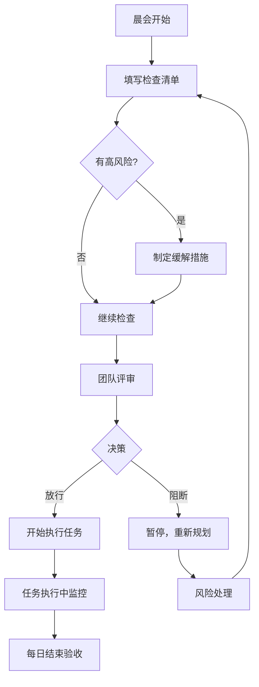

# Week 4-5 每日风险检查清单

**使用说明：**
- 每天任务开始前填写此清单
- 复制模板到新的日期文件
- 完成后在风险看板更新状态

---

## 📋 模板：日期 YYYY-MM-DD 风险检查

### 🎯 今日任务信息

| 项目 | 内容 |
|------|------|
| **日期** | YYYY-MM-DD |
| **任务编号** | Task ### |
| **任务名称** | [填写] |
| **负责Agent** | [填写] |
| **预计时间** | [填写] |
| **依赖任务** | [填写] |

---

### ⚠️ 任务开始前风险检查

#### 1. 安全风险检查 (Pentester)

```
检查项                                状态    备注
━━━━━━━━━━━━━━━━━━━━━━━━━━━━━━━━━━━━━━━━━━━━━━━━━━
输入验证是否完整？                    □ 是 □ 否
  - SQL注入防护                      □ 已检查
  - XSS防护                          □ 已检查
  - 命令注入防护                      □ 已检查
  - 路径遍历防护                      □ 已检查

认证授权是否正确？                    □ 是 □ 否
  - API鉴权机制                      □ 已检查
  - 权限验证                          □ 已检查

敏感数据是否加密？                    □ 是 □ 否
  - 传输加密 (HTTPS)                 □ 已检查
  - 存储加密（如需要）                □ 已检查

错误信息是否安全？                    □ 是 □ 否
  - 不泄露内部路径                    □ 已检查
  - 不泄露敏感信息                    □ 已检查

依赖库是否有已知漏洞？                □ 是 □ 否
  - bun audit 通过                   □ 已检查
```

#### 2. 性能风险检查 (Architect)

```
检查项                                状态    备注
━━━━━━━━━━━━━━━━━━━━━━━━━━━━━━━━━━━━━━━━━━━━━━━━━━
是否有 N+1 查询问题？                 □ 是 □ 否
  - 批量查询优化                      □ 已检查

是否有潜在内存泄漏？                  □ 是 □ 否
  - 事件监听清理                      □ 已检查
  - 缓存大小控制                      □ 已检查

缓存策略是否合理？                    □ 是 □ 否
  - TTL 设置                         □ 已检查
  - 缓存失效策略                      □ 已检查

大数据量场景是否考虑？                □ 是 □ 否
  - 分页处理                          □ 已检查
  - 流式处理（如需要）                □ 已检查
```

#### 3. 质量风险检查 (QATester)

```
检查项                                状态    备注
━━━━━━━━━━━━━━━━━━━━━━━━━━━━━━━━━━━━━━━━━━━━━━━━━━
测试用例是否完整？                    □ 是 □ 否
  - 正常路径                          □ 已覆盖
  - 异常路径                          □ 已覆盖
  - 边界条件                          □ 已覆盖

错误处理是否测试？                    □ 是 □ 否
  - 网络错误                          □ 已测试
  - 数据格式错误                      □ 已测试
  - 超时处理                          □ 已测试

并发场景是否考虑？                    □ 是 □ 否
  - 文件锁测试                        □ 已测试
  - 并发写入测试                      □ 已测试
```

#### 4. 集成风险检查 (Engineer)

```
检查项                                状态    备注
━━━━━━━━━━━━━━━━━━━━━━━━━━━━━━━━━━━━━━━━━━━━━━━━━━
API 接口是否稳定？                    □ 是 □ 否
  - 请求/响应格式                     □ 已定义
  - 错误码统一                        □ 已检查

数据格式是否兼容？                    □ 是 □ 否
  - JSON Schema                       □ 已定义
  - 类型转换                          □ 已处理

向后兼容性是否保证？                  □ 是 □ 否
  - 现有API不破坏                     □ 已检查
```

---

### 📊 风险评级

| 级别 | 数量 | 风险列表 |
|------|------|---------|
| 🔴 高风险 | __ | [列出] |
| 🟡 中风险 | __ | [列出] |
| 🟢 低风险 | __ | [列出] |

---

### ✅ 放行条件

```
□ 所有高风险已缓解
□ 中风险有监控方案
□ 团队已知悉所有风险
□ 负责人已确认
```

---

### 🚦 决策

**选择一项：**

- □ **放行** - 所有风险可接受，开始执行
- □ **有条件放行** - 部分风险需监控，开始执行
- □ **阻断** - 风险不可接受，暂停执行

**决策理由：**
```
[填写决策理由]
```

---

### 👥 确认签字

| 角色 | Agent | 确认 |
|------|-------|------|
| 检查执行人 | Pentester | 签字：__________ 日期：__________ |
| 技术审核人 | Architect | 签字：__________ 日期：__________ |
| 质量审核人 | QATester | 签字：__________ 日期：__________ |
| 最终批准人 | Engineer | 签字：__________ 日期：__________ |

---

## 📝 使用示例

### 示例：Day 1 - AnalyticsService 实现

**日期：** 2026-02-05
**任务：** Task #201 - AnalyticsService 核心实现
**负责Agent：** Engineer

#### 安全检查
```
✅ 输入验证：Zod schema 已定义
✅ 敏感数据：不涉及
✅ 错误信息：不泄露内部路径
✅ 依赖检查：bun audit 通过
```

#### 性能检查
```
✅ N+1查询：不涉及数据库查询
✅ 内存泄漏：使用 LRU 缓存，有限制
⚠️ 缓存策略：需进一步验证 TTL 设置
✅ 大数据量：使用分页处理
```

#### 风险评级
- 🟡 中风险：缓存策略需要验证

#### 决策
**有条件放行** - 缓存策略在代码审查时重点关注

---

## 🔄 每日风险检查流程



---

## 📌 快速参考

### 风险等级定义

| 等级 | 说明 | 示例 |
|------|------|------|
| 🔴 高 | 可能影响安全、性能、交付 | SQL注入、内存泄漏、API设计缺陷 |
| 🟡 中 | 需要关注但不阻断 | 缓存策略、错误处理完善度 |
| 🟢 低 | 优化建议，可延后 | 代码风格、文档完善 |

### 常见缓解措施

| 风险类型 | 缓解措施 |
|---------|---------|
| 输入验证 | Zod schema、白名单过滤 |
| 性能问题 | 缓存、异步处理、分页 |
| 并发问题 | FileLock、队列 |
| 数据一致性 | 校验和、事务、重试机制 |

---

**模板版本：** 1.0.0
**创建时间：** 2026-02-04
**维护者：** Pentester Agent

**每日必填！风险前置，安全第一！**
