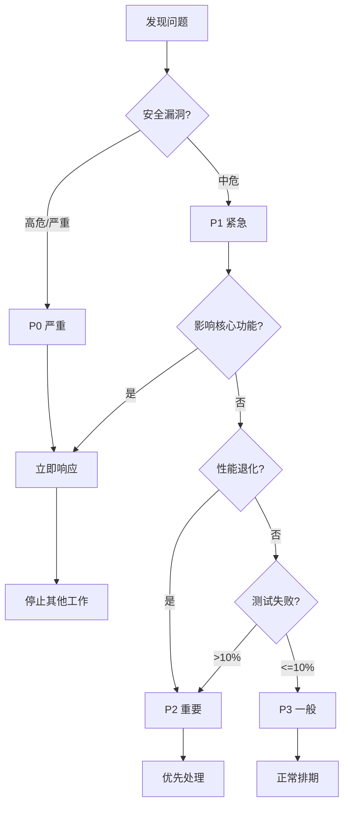
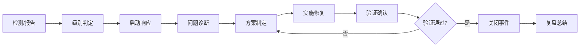

# Week 4-5 应急响应预案

**文档版本：** 1.0.0
**创建时间：** 2026-02-04
**维护者：** Pentester Agent
**适用范围：** Week 4-5 Analytics + REST API 实施

---

## 目录

1. [响应级别定义](#1-响应级别定义)
2. [应急响应流程](#2-应急响应流程)
3. [场景预案](#3-场景预案)
4. [通信协议](#4-通信协议)
5. [恢复验证](#5-恢复验证)

---

## 1. 响应级别定义

### 1.1 级别分类

| 级别 | 名称 | 触发条件 | 响应时间 | 处理方式 |
|------|------|---------|---------|---------|
| **P0** | 严重 | 系统不可用、数据泄露、高危安全漏洞 | **立即** | 停止一切，全力修复 |
| **P1** | 紧急 | 核心功能异常、中危安全漏洞 | **1小时内** | 优先处理，暂停其他任务 |
| **P2** | 重要 | 性能退化、测试失败率>10% | **4小时内** | 计划修复，当天完成 |
| **P3** | 一般 | 非核心问题、优化建议 | **24小时内** | 正常排期处理 |

### 1.2 级别判定流程图



---

## 2. 应急响应流程

### 2.1 通用响应流程

适用于所有应急场景的标准流程：



### 2.2 响应阶段详解

#### 阶段一：检测与报告 (0-5分钟)

**责任人：** 任何发现问题的 Agent

**行动清单：**
- [ ] 确认问题真实存在（非误报）
- [ ] 收集问题基本信息
- [ ] 初始级别判定
- [ ] 立即通知应急联系人

**报告模板：**

```markdown
## 🚨 应急事件报告

**时间：** YYYY-MM-DD HH:MM:SS
**报告人：** [Agent]
**事件编号：** INC-YYYYMMDD-###
**初步级别：** P0 / P1 / P2 / P3

### 问题描述
- 问题类型：[安全/性能/质量/集成]
- 发生位置：[模块/文件/行号]
- 症状描述：[详细描述]

### 影响评估
- 影响功能：[列出受影响功能]
- 影响用户：[估计]
- 数据风险：[是/否]

### 已采取行动
- [ ] 已停止相关操作（如适用）
- [ ] 已通知相关人员
- [ ] 已收集日志/证据

**附件：** [日志截图/错误信息]
```

#### 阶段二：级别确认与响应启动 (5-15分钟)

**责任人：** Pentester + Architect

**行动清单：**
- [ ] 确认最终级别
- [ ] 启动对应级别的响应流程
- [ ] 分配任务和资源
- [ ] 设定首次状态更新时间

**级别确认标准：**

| 条件 | P0 | P1 | P2 | P3 |
|------|----|----|----|-----|
| 数据泄露风险 | 是 | 否 | 否 | 否 |
| 系统完全不可用 | 是 | 否 | 否 | 否 |
| 核心功能异常 | 是 | 是 | 否 | 否 |
| 安全漏洞（高/中/低） | 高 | 中 | 低 | - |
| 性能退化 >50% | 是 | 否 | 是 | 否 |
| 测试失败率 >20% | 是 | 是 | 是 | 否 |
| 测试失败率 10-20% | 否 | 否 | 是 | 否 |
| 测试失败率 <10% | 否 | 否 | 否 | 是 |

#### 阶段三：问题诊断 (15分钟-2小时)

**责任人：** Architect + Engineer

**行动清单：**
- [ ] 复现问题
- [ ] 定位根本原因
- [ ] 评估修复范围
- [ ] 估计修复时间

**诊断方法：**

| 问题类型 | 诊断工具 | 方法 |
|---------|---------|------|
| 安全漏洞 | 代码审计、日志分析 | 追踪数据流、权限检查 |
| 性能问题 | Profiler、监控数据 | 热点分析、资源分析 |
| 测试失败 | 测试日志、调试器 | 断点调试、变量追踪 |
| 集成问题 | API日志、Mock数据 | 接口契约验证 |

#### 阶段四：方案制定与实施 (2-8小时)

**责任人：** Engineer + CodeReviewer

**行动清单：**
- [ ] 设计修复方案
- [ ] 编写修复代码
- [ ] 编写/更新测试
- [ ] 代码审查

**修复方案模板：**

```markdown
## 修复方案

**问题：** [问题描述]
**根本原因：** [根因分析]

### 修复方案
- 方案描述：[详细说明]
- 涉及文件：[列出]
- 预计时间：[小时]

### 风险评估
- 引入新风险：[是/否，说明]
- 回归风险：[评估]

### 测试计划
- 单元测试：[新增/修改]
- 集成测试：[新增/修改]
- 验证方式：[说明]

**审核人：** ____________
**批准时间：** ____________
```

#### 阶段五：验证与确认 (1-2小时)

**责任人：** QATester + Pentester

**验证清单：**
- [ ] 单元测试全部通过
- [ ] 集成测试全部通过
- [ ] 安全测试通过
- [ ] 性能基准达标
- [ ] 无功能回归

#### 阶段六：关闭与复盘 (完成后24小时内)

**责任人：** 全体团队

**复盘模板：**

```markdown
## 应急事件复盘

**事件编号：** INC-YYYYMMDD-###
**发生时间：** YYYY-MM-DD HH:MM:SS
**解决时间：** YYYY-MM-DD HH:MM:SS
**持续时间：** [小时]

### 事件概述
- 问题描述：[总结]
- 影响范围：[总结]
- 解决方案：[总结]

### 根本原因
- 直接原因：[分析]
- 潜在原因：[分析]
- 系统性问题：[分析]

### 改进措施
- 即时措施：[已采取]
- 预防措施：[计划采取]
- 流程改进：[建议]

### 经验教训
- 做得好的：[列出]
- 需要改进的：[列出]

**参与者：** [列出]
**文档更新：** [更新了哪些文档]
```

---

## 3. 场景预案

### 场景一：测试失败率 >10%

**级别：** P2 重要（可能升级为 P1）

**触发条件：**
- 单次测试运行失败率 >10%
- 连续3次测试运行失败率 >5%
- 核心功能（Analytics、API）测试失败

**响应流程：**

```yaml
第一阶段: 立即响应 (0-15分钟)
  Actions:
    - 停止新功能开发
    - 识别失败测试类别
    - 判定影响范围
    - 通知团队

第二阶段: 问题诊断 (15-60分钟)
  Actions:
    - 分析失败原因（代码问题 vs 测试问题）
    - 复现失败场景
    - 评估修复时间
    - 决定是否升级

第三阶段: 修复执行 (1-4小时)
  Actions:
    - 修复代码或测试
    - 修复后立即验证
    - 确认无回归问题
    - 更新测试用例

第四阶段: 根因分析 (完成后)
  Actions:
    - 记录根本原因
    - 更新预防措施
    - 更新检查清单
```

**升级条件：**
- 1小时内无法修复 → 升级为 P1
- 影响交付里程碑 → 升级为 P0
- 核心数据损坏 → 升级为 P0

**检查清单：**

```markdown
## 测试失败应急检查

### 问题分类
□ 代码Bug（实现错误）
□ 测试Bug（测试用例错误）
□ 环境问题（依赖、配置）
□ 数据问题（测试数据）
□ 并发问题（竞争条件）

### 快速诊断
□ 运行单个失败测试，获取详细日志
□ 检查最近代码变更
□ 检查依赖更新
□ 检查环境配置

### 修复优先级
1. 核心功能测试（Analytics、API）
2. 集成测试
3. 边界条件测试
4. 其他测试
```

---

### 场景二：发现严重安全漏洞

**级别：** P0 严重 / P1 紧急

**触发条件：**
- SQL 注入、命令执行、认证绕过等高危漏洞 → P0
- XSS、CSRF、信息泄露等中危漏洞 → P1

**响应流程：**

```yaml
第一阶段: 紧急止损 (0-5分钟)
  Actions:
    - 停止相关功能开发
    - 如已部署，立即回滚
    - 通知 Pentester 和 Architect
    - 保护现场（日志、证据）

第二阶段: 漏洞分析 (5-30分钟)
  Actions:
    - 确认漏洞细节（攻击向量）
    - 评估影响范围
    - 确定数据泄露风险
    - 判定漏洞级别

第三阶段: 修复开发 (30分钟-4小时)
  Actions:
    - 设计修复方案
    - 编写修复代码
    - 编写安全测试用例
    - 进行代码审查（双审查）

第四阶段: 验证部署 (4-8小时)
  Actions:
    - 安全测试验证
    - 模糊测试（Fuzzing）
    - 回归测试
    - 性能验证

第五阶段: 威胁模型更新 (完成后)
  Actions:
    - 更新威胁模型
    - 更新安全检查清单
    - 更新安全测试用例
    - 团队安全培训
```

**常见漏洞快速修复指南：**

| 漏洞类型 | 快速修复 | 验证方法 |
|---------|---------|---------|
| SQL注入 | 使用参数化查询/ORM | SQL注入测试用例 |
| XSS | 输出HTML编码 | XSS攻击测试 |
| 命令注入 | 避免shell执行，使用API | 命令注入测试 |
| 路径遍历 | 路径白名单验证 | 路径遍历测试 |
| 认证绕过 | 检查认证逻辑 | 认证测试套件 |

---

### 场景三：性能不达标

**级别：** P2 重要

**触发条件：**
- API 响应时间 P95 >100ms
- 内存占用 >200MB
- CPU 使用率持续 >80%

**响应流程：**

```yaml
第一阶段: 性能分析 (0-30分钟)
  Actions:
    - 使用性能分析工具定位瓶颈
    - 确定是算法问题还是实现问题
    - 评估优化收益
    - 决定优化方案

第二阶段: 优化方案 (30分钟-2小时)
  Actions:
    - 设计优化方案
    - 评估优化风险
    - 获得团队批准
    - 编写优化代码

第三阶段: 优化实施 (2-8小时)
  Actions:
    - 实施性能优化
    - 保持测试通过
    - 性能基准测试
    - 对比优化前后

第四阶段: 验证确认 (8-12小时)
  Actions:
    - 确认性能达标
    - 确认无功能回归
    - 更新性能文档
    - 记录优化成果
```

**性能优化清单：**

```markdown
## 性能优化检查

### 算法层面
□ 减少时间复杂度（O(n^2) -> O(n)）
□ 减少空间复杂度
□ 避免嵌套循环

### 实现层面
□ 使用缓存（避免重复计算）
□ 批量操作（减少IO）
□ 异步处理（非阻塞）
□ 懒加载（按需加载）

### 数据层面
□ 索引优化
□ 分页处理
□ 数据压缩

### 架构层面
□ 服务拆分
□ 负载均衡
□ CDN加速
```

**降级方案：**

```yaml
触发条件:
  - 优化后仍不达标
  - 优化成本过高（时间/复杂度）

降级措施:
  缓存层:
    - 添加 Redis/Memory 缓存
    - 延长 TTL

  处理方式:
    - 异步处理（返回任务ID）
    - 降级采样

  访问控制:
    - 限流（Rate Limiting）
    - 分页限制

恢复计划:
  - 记录技术债务
  - 计划后续优化
  - 持续监控性能
```

---

### 场景四：数据一致性问题

**级别：** P0 严重 / P1 紧急

**触发条件：**
- 并发写入导致数据损坏 → P0
- 读写不一致 → P1
- 数据迁移失败 → P1

**响应流程：**

```yaml
第一阶段: 紧急保护 (0-5分钟)
  Actions:
    - 停止所有写入操作
    - 备份现有数据
    - 隔离问题环境
    - 通知相关人员

第二阶段: 问题诊断 (5-30分钟)
  Actions:
    - 分析日志定位问题
    - 确定数据损坏范围
    - 评估数据可恢复性
    - 确定问题原因

第三阶段: 数据恢复 (30分钟-4小时)
  Actions:
    - 从备份恢复数据
    - 重新执行数据迁移
    - 验证数据完整性
    - 校验和验证

第四阶段: 根因修复 (4-8小时)
  Actions:
    - 修复并发控制（FileLock）
    - 增强数据验证
    - 添加事务支持
    - 更新错误处理
```

**数据恢复清单：**

```markdown
## 数据恢复检查

### 立即行动
□ 停止所有写入
□ 备份当前状态
□ 标记问题文件

### 恢复方案
□ 从最近备份恢复
□ 重放操作日志（如可用）
□ 手动修复（小规模数据）

### 验证
□ 数据完整性校验
□ 功能验证
□ 性能验证

### 预防
□ 检查 FileLock 使用
□ 添加数据校验
□ 完善错误处理
```

---

## 4. 通信协议

### 4.1 通知层级

| 级别 | 通知范围 | 通知方式 | 频率 |
|------|---------|---------|------|
| P0 | 全员 + 项目负责人 | 立即会议 + 消息 | 每小时 |
| P1 | 实施组 + 审核组 | 消息 + 会议 | 每2小时 |
| P2 | 实施组 | 消息 | 每4小时 |
| P3 | 负责Agent | 消息 | 每日 |

### 4.2 状态更新模板

```markdown
## 应急事件状态更新

**事件编号：** INC-YYYYMMDD-###
**更新时间：** YYYY-MM-DD HH:MM:SS
**当前状态：** 🔴 响应中 / 🟡 修复中 / 🟢 验证中 / ✅ 已关闭

### 当前进展
- [进展描述]

### 遇到问题
- [如有]

### 下一步计划
- [计划]

### 预计完成时间
- [时间]

**更新人：** [Agent]
```

### 4.3 升级路径

```
发现问题 → 初步评估 → 通知负责人 → 启动响应
                                    ↓
                            定期状态更新
                                    ↓
                            {是否解决?}
                              ↙        ↘
                           是          否
                           ↓           ↓
                        关闭事件    升级级别
                                       ↓
                                  扩大通知范围
```

---

## 5. 恢复验证

### 5.1 验证清单

**通用验证：**
- [ ] 修复后测试全部通过
- [ ] 无新增警告或错误
- [ ] 性能指标达标
- [ ] 安全扫描通过

**场景特定验证：**

| 场景 | 验证项 |
|------|--------|
| **测试失败** | 新增测试用例，覆盖失败场景 |
| **安全漏洞** | 安全测试通过，威胁模型更新 |
| **性能问题** | 性能基准达标，无退化 |
| **数据问题** | 数据完整性校验，功能正常 |

### 5.2 回归测试

```markdown
## 回归测试清单

### 必测项（全部）
□ Analytics 相关测试
□ REST API 相关测试
□ 集成测试
□ 性能测试
□ 安全测试

### 选测项（根据变更）
□ 受影响的模块
□ 依赖该功能的下游
□ 相关的边界条件
```

### 5.3 关闭标准

事件关闭需要满足：

1. **问题已解决** - 修复验证通过
2. **无副作用** - 无功能回归
3. **根因已明确** - 知道为什么发生
4. **预防已落实** - 已采取措施防止再次发生
5. **文档已更新** - 威胁模型、检查清单已更新

---

## 附录

### A. 应急联系人

| 角色 | Agent | 职责 | 可用时间 |
|------|-------|------|---------|
| 应急负责人 | Pentester | 级别判定、协调响应 | 7x24 |
| 技术负责人 | Architect | 技术方案、资源协调 | 工作时间 |
| 质量负责人 | QATester | 验证确认、质量把关 | 工作时间 |
| 实施负责人 | Engineer | 修复实施、代码提交 | 工作时间 |

### B. 应急工具

```bash
# 应急响应脚本
scripts/
├── emergency-stop.sh        # 紧急停止脚本
├── backup-data.sh           # 数据备份脚本
├── restore-data.sh          # 数据恢复脚本
├── security-scan.sh         # 安全扫描脚本
├── performance-test.sh      # 性能测试脚本
└── regression-test.sh       # 回归测试脚本
```

### C. 快速参考

```markdown
## 快速决策树

问题发现
  │
  ├─ 安全漏洞?
  │   ├─ 高危? → P0 → 立即停止，全力修复
  │   └─ 中危? → P1 → 优先处理
  │
  ├─ 数据损坏?
  │   └─ 是 → P0 → 立即停止，恢复数据
  │
  ├─ 核心功能异常?
  │   ├─ 是 → P1 → 优先处理
  │   └─ 否 → 继续
  │
  ├─ 性能问题?
  │   ├─ 严重退化? → P1 → 优先处理
  │   └─ 轻微退化? → P2 → 计划修复
  │
  └─ 测试失败?
      ├─ >10%? → P2 → 计划修复
      └─ <10%? → P3 → 正常排期
```

---

**文档版本：** 1.0.0
**创建时间：** 2026-02-04
**维护者：** Pentester Agent
**审核者：** Architect Agent

**应急预案核心原则：**
- **快速反应** - 时间就是数据
- **冷静分析** - 不要慌乱
- **有效沟通** - 保持信息同步
- **彻底解决** - 根治而非表面修复

---

**PAI - Personal AI Infrastructure**
**Version: 2.5**
